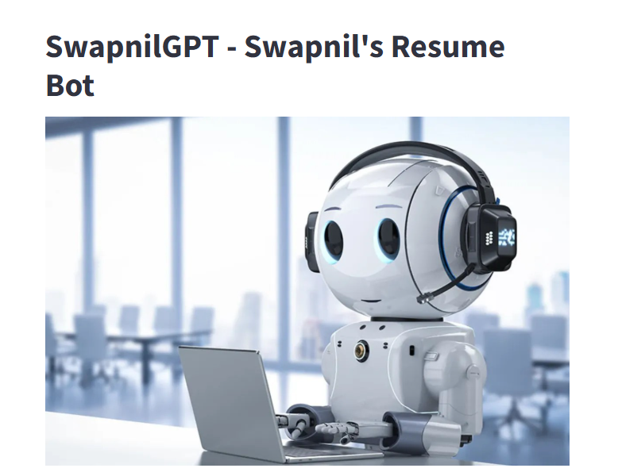
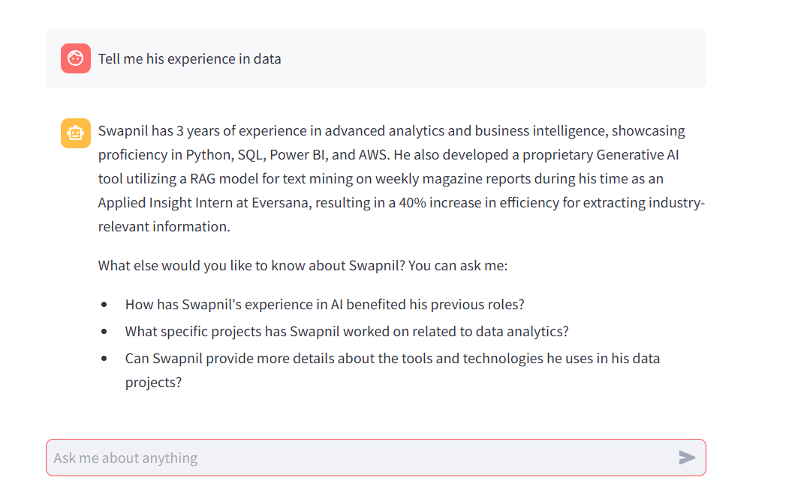

# SwapnilGPT – Resume Bot

**SwapnilGPT** is a virtual assistant built to answer questions about **me** — covering educational background, professional experience, internships, technical skills, projects, and career goals.

---

## 🎯 Purpose

The goal of SwapnilGPT is to make my professional profile easily accessible and interactive. Instead of reading through a static resume, you can chat with the bot to learn more about my journey, expertise, and achievements in **Data Science**, **Machine Learning**, **Data Engineering**, and **Analytics**.

---

## 🛠 Tech Stack

- **Streamlit** – Interactive web app interface
- **LangChain** – Orchestrates conversation and retrieval
- **OpenAI API** – Powers the LLM for natural language responses
- **FAISS / Pinecone** – Vector database for semantic search over my resume content
- **Python** – Backend logic and integration

---

## 💡 Features

- **Ask Anything**: Inquire about my education, internships, professional projects, skills, and more.
- **Project Highlights**: Get detailed summaries of my key data science and machine learning projects.
- **Career Goals**: Learn about my future plans and areas of interest.
- **Technical Expertise**: Explore my skills in Python, SQL, AWS, Tableau, and advanced ML techniques.

---

## 🚀 How to Use

1. Visit the [SwapnilGPT Hugging Face Space](https://huggingface.co/spaces/swapnilbanduke/SwapnilGPT)
2. Type a question in the chat box — e.g.,  
   - *"Tell me about your education"*  
   - *"What was your role at CISLA?"*  
   - *"List your technical skills"*  
3. The bot will respond with relevant details from my resume.

---

## 📌 Example Questions

- "What internships have you completed?"
- "Describe your project on call volume forecasting."
- "What are your skills in AWS and cloud technologies?"
- "What is your GPA and graduation date?"

---

## 👤 Author

**Swapnil C. Banduke**  
M.S. in Business Analytics & Artificial Intelligence – University of Texas at Dallas  
[GitHub](https://github.com/swapnilbanduke) | [LinkedIn](https://www.linkedin.com/in/swapnilbanduke)

---

